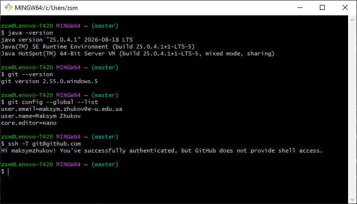
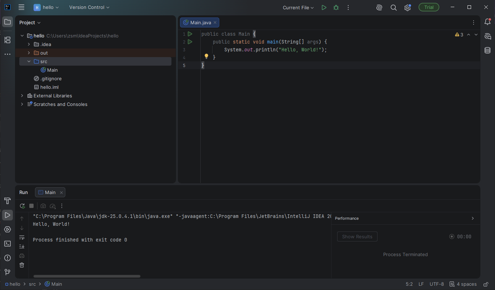
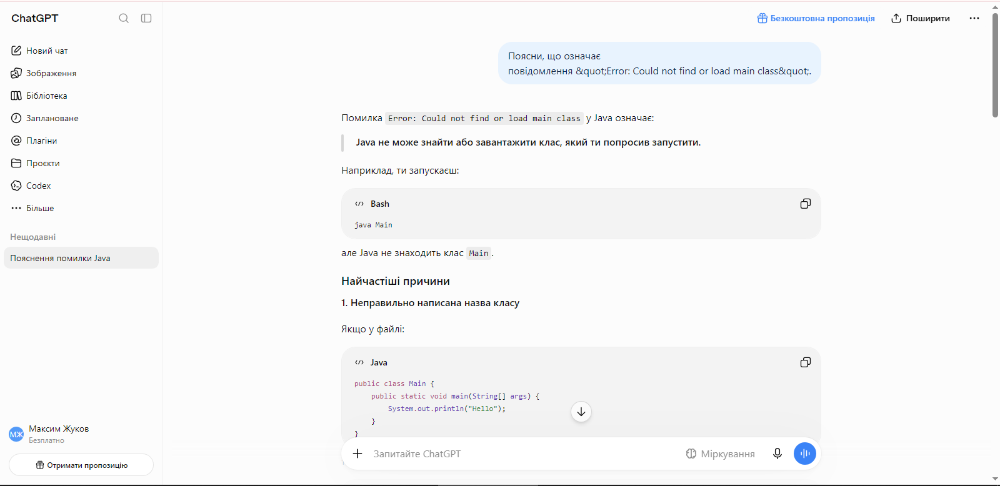

# Практичне заняття № 0. Підготовка робочого середовища розробника

- **Студент:** Жуков Максим Сергійович
- **Група:** F5 213
- **Дисципліна:** Алгоритмізація та основи програмування

## Профілі
- GitHub: https://github.com/maksymzhukov
- LeetCode: https://leetcode.com/u/sW1tDUAeNm/
- HackerRank: https://www.hackerrank.com/profile/maksym_zhukov

## Знімки екрана

### java, javac, git, git config, SSH-з'єднання з GitHub

### IntelliJ IDEA: Hello, World!

### HackerRank: Welcome to Java!

### ChatGPT

### Claude Code
Доступ до Claude Code не оформлювався.